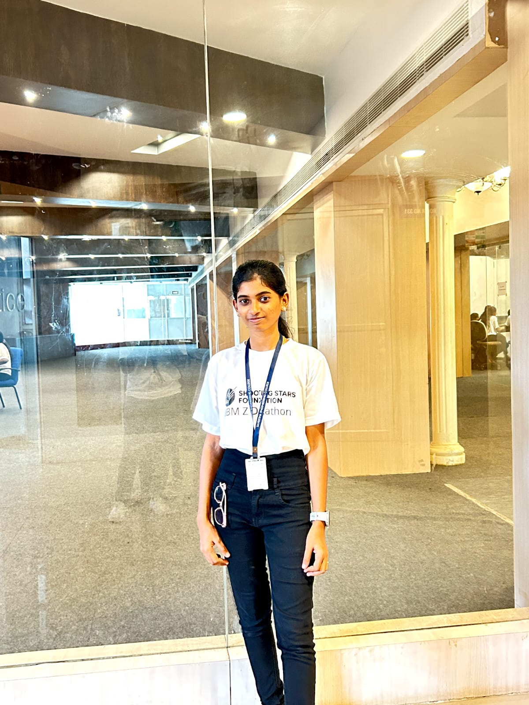

# Styled_Profile_Card
## Date:

## Objective:
To practice HTML and CSS fundamentals by designing a visually appealing profile card that demonstrates the use of background color, typography, spacing, and layout alignment techniques.

## Tasks:
#### 1. Create the HTML Structure:
Use ```<!DOCTYPE html>, <html>, <head>, and <body>``` to define the structure.
Add a ```<title>``` like "My Profile Card".

#### 2. Add Content:
Include name, title (e.g., Developer, Student), and a short bio using semantic tags such as ```<h1>```, ```<h2>```, and ```<p>```.

#### 3. Add a Profile Image:
Use the `````` tag to include a profile picture with appropriate alt, width, and height attributes.

#### 4. Apply Background Color:
Use a CSS class to style the card with a background color.

#### 5. Style Typography:
Use CSS to apply different font families, sizes, and text colors for the name and bio.

#### 6. Add Spacing:
Apply margin and padding to improve spacing between elements using CSS.

#### 7. Center the Card:
Use flexbox or margin: auto to center the card vertically and horizontally on the page.

#### 8. Add Hover Effects:
Enhance interactivity with simple hover effects like border changes or background transition using CSS.

## HTML Code:
```
<!DOCTYPE html>
<html lang="en">
    <head>
    <meta charset="UTF-8">
    <meta name="viewport" content="width-device-width,initial-scale=1.0">
    <title>My Profile</title>
    <link href="style.css" rel="stylesheet">
    </head>
    <body>
        <h1>Prema Latha S</h1>
        <hr>
        <h2>Student</h2>
        <hr>
        <h3>Web Developer</h3>
        <hr>
        
        <hr>
        <section>
            <h2>About Me</h2>
            <p>
                 Hello! I am Prema Latha S currently pursuing a 3rd year Artificial Intelligence & Data Science department in Saveetha Engineering College.I am a passionate and dedicated student interested in web development and technology. I enjoy learning new skills, building creative projects, and continuously improving myself.
            </p>
        </section>
        <hr>
        <section>
             <h2>Skills</h2>
             <ul>
                 <li>HTML</li>
                 <li>CSS</li>
                 <li>Javascript</li>
                 <li>SQL</li>
                 <li>React Js</li>
                 <li>Node Js</li>
             </ul>
        </section>
        <hr>
        <section>
            <h2>Interests</h2>
            <p>Coding, designing websites, playing chess, and exploring new places.</p>
        </section>
    </body>
</html>
```
## Style.CSS:
```
body {
    font-family: Arial, sans-serif;
    background-color: #f2f2f2;
    margin: 20px;
}

h1 {
    text-align: center;
    color: #2c3e50; 
}

h2 {
    text-align: center;
    color: #2980b9; 
}

h3 {
    text-align: center;
    color:#2980b9; 
}

img {
    display: block;
    margin: 0 auto;
    border-radius: 10px;
    border: 3px solid #555;
}

section {
    background-color: #ffffff;
    padding: 15px;
    margin: 20px auto;
    width: 80%;
    border-radius: 8px;
}

ul {
    list-style-type: square;
}

ul li {
    color: #34495e; 
    margin: 5px ;
}

p {
    line-height: 1.6;
    color: #555555;
}

hr {
    border: none;
    height: 2px;
    background-color: #3498db; 
    margin: 20px ;
}

```
## Output:


## Result:
A visually appealing profile card that demonstrates the use of background color, typography, spacing, and layout alignment techniques is designed.
